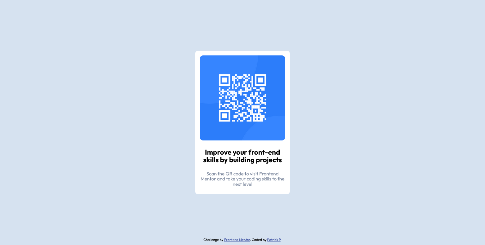

# Frontend Mentor - QR code component solution

This is a solution to the [QR code component challenge on Frontend Mentor](https://www.frontendmentor.io/challenges/qr-code-component-iux_sIO_H). Frontend Mentor challenges help you improve your coding skills by building realistic projects.

## Table of contents

- [Overview](#overview)
  - [Screenshot](#screenshot)
  - [Links](#links)
- [My process](#my-process)
  - [Built with](#built-with)
- [Author](#author)
- [Acknowledgments](#acknowledgments)

## Overview

### Screenshot

### Links

- Solution URL: [https://github.com/patrickp19/qr-code-component-main](https://your-solution-url.com)
- Live Site URL: [https://patrickp19.github.io/qr-code-component-main/](https://patrickp19.github.io/qr-code-component-main/)

## My process

### Built with

- Semantic HTML5 markup
- CSS custom properties
- Flexbox
- CSS Grid

## Author

- Github - [github.com/patrickp19](https://github.com/patrickp19/)
- Frontend Mentor - [@patrickp19](https://www.https://www.frontendmentor.io/profile/patrickp19)

## Acknowledgments

Thank you to Kevin Powell and his course - CSS demystified (https://courses.kevinpowell.co/view/courses/css-demystified)

Learned how to:

- Write a CSS reset template
- Useful ways to write CSS custom properties
- Write semantic CSS
